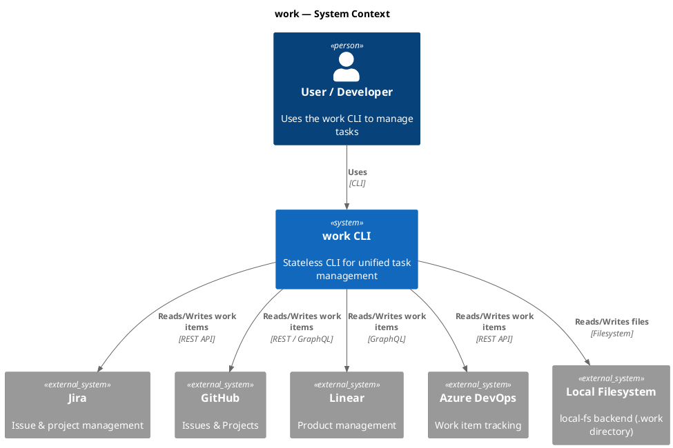
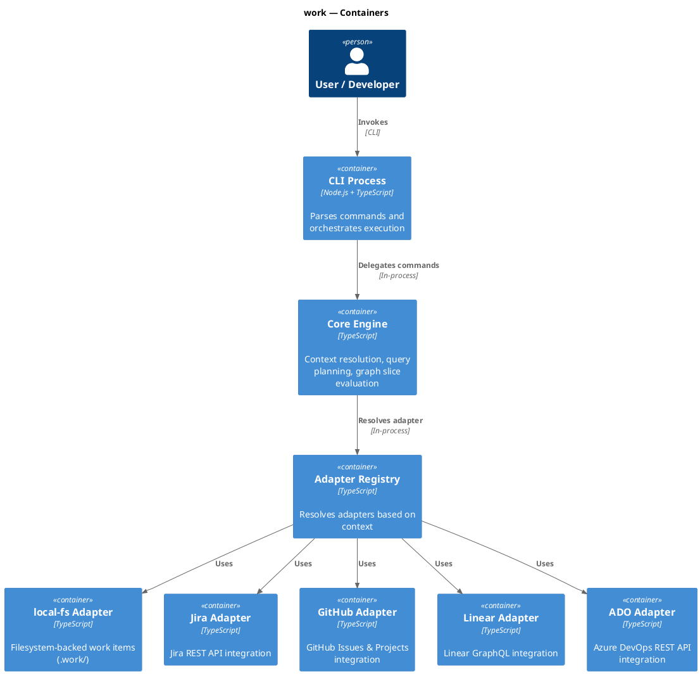
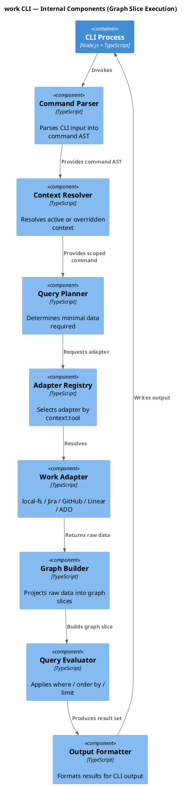
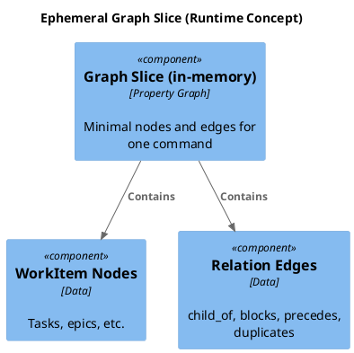

# work — C4 Architecture Diagrams (Corrected)

This document contains **C4 PlantUML diagrams** for the `work` CLI.
All entity definitions follow **C4 rules**: **no line breaks inside element definitions**.

---

## 1. System Context Diagram

---

## 2. Container Diagram

---

## 3. Component Diagram (Inside the CLI)

---

## 4. Runtime Graph Slice Concept

---

## Notes

- All C4 elements use **single-line definitions**
- Diagrams are compatible with **plantuml.com**
- Architecture reflects **stateless execution with ephemeral graph slices**
